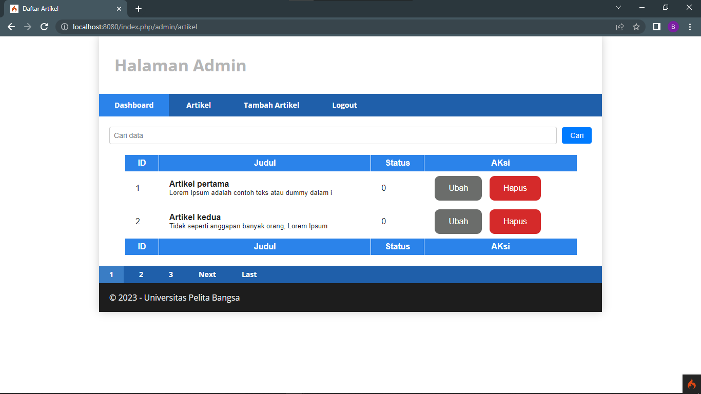

# <P align="center"> **Lab11Web**

---


# <p align="center">Praktikum 10: PHP Framework (Codeigniter)      (Lanjutan Praktikum 7.3)</p>

### Tujuan
* Mampu memahami konsep dasar _Pagination_.
* Mampu memahami konsep dasar _Pencarian_.
* Mampu membuat program sederhana menggunakan _Framework Codeigniter4_.

### Instruksi Praktikum
* Persiapkan text editor misalnya VSCode.
* Buat folder baru dengan nama lab10_php_ci pada docroot webserver (htdocs)
* Ikuti langkah-langkah praktikum yang akan dijelaskan berikutnya.


---
# <p align="center">Langkah-langkah Praktikum</p>


# Langkah-langkah & Persiapan
## Membuat Pagination
<p>Pagination merupakan proses yang digunakan untuk membatasi tampilan yang panjang
dari data yang banyak pada sebuah website. Fungsi pagination adalah memecah tampilan
menjadi beberapa halaman tergantung banyaknya data yang akan ditampilkan pada
setiap halaman.</p>
<p>Pada Codeigniter 4, fungsi pagination sudah tersedia pada Library sehingga cukup mudah
menggunakannya.</p>

- Untuk membuat pagination, buka Controller Artikel, lakukan modifikasi kode pada method admin_index seperti berikut.

```php
public function admin_index()
{
$title = 'Daftar Artikel';
$model = new ArtikelModel();
$data = [
'title' => $title,
'artikel' => $model->paginate(10), #data dibatasi 10 record
per halaman
'pager' => $model->pager,
];
return view('artikel/admin_index', $data);
}
```

- Buka file views/artikel/admin_index.php dan tambahkan kode berikut dibawah deklarasi tabel data.

```php
<?= $pager->links(); ?>
```


## Membuat Pencarian
<p>Pencarian data digunakan untuk memfilter data.</p><br>
- Untuk membuat pencarian data, buka kembali Controller Artikel, pada method admin_index ubah kodenya seperti berikut.

```php
    public function admin_index()
    {
        $title = 'Daftar Artikel';
        $q = $this->request->getVar('q') ?? '';
        $model = new ArtikelModel();
        $data = [
            'title' => $title,
            'q' => $q,
            'artikel' => $model->like('judul', $q)->paginate(5), # data dibatasi 10 record per halaman
            'pager' => $model->pager,
        ];
        return view('artikel/admin_index', $data);
    }
```

- Buka kembali file views/artikel/admin_index.php dan tambahkan form pencarian sebelum deklarasi tabel seperti berikut:

```php
  <form method="get" class="form-search">
    <input type="text" name="q" value="<?= $q; ?>" class="text-search" placeholder="Cari data">
    <input type="submit" value="Cari" class="submit-search">
  </form>
```

- Pada link pager ubah seperti berikut.

```php
<?= $pager->only(['q'])->links(); ?>
```


## Hasil 

- Buka halaman admin artikel, masukkan kata kunci tertentu pada form pencarian.



---
# <P align="center"> THANK YOU!!